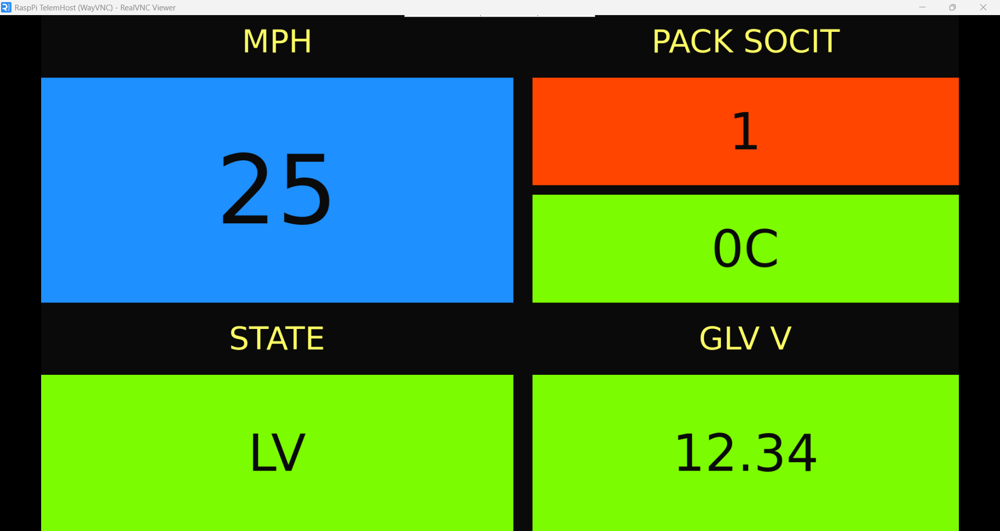

# Display
Software for FRUCD's Dashboard Display.



# How To Use
Requires CMake version >= 3.29. Note that this is only intended to be built on the Raspberry Pi.
To configure and generate build system:
```
cmake -S . -B Build
```
From then on, compile the project used the generated build system:
```
cmake --build Build
./Build/frucd_raspi_dash
```