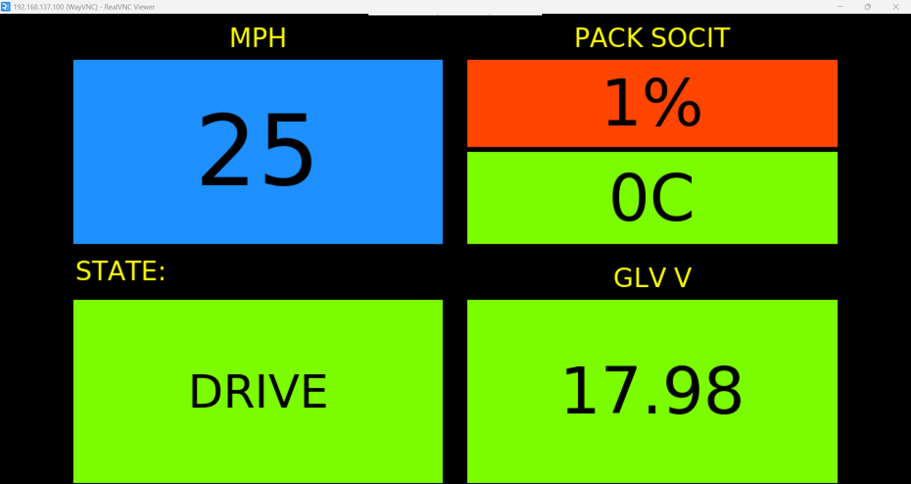

# Raspberry Pi Telemetry Host
Displays and logs telemetry data received over CAN using a Raspberry Pi.



```ini
# Example systemd service
[Unit]
Description=FRUCD Telemetry Host

[Service]
ExecStart=/bin/bash /path/to/RaspPi-TelemHost/startup.sh
User=<your-username>
Restart=always

[Install]
WantedBy=multi-user.target